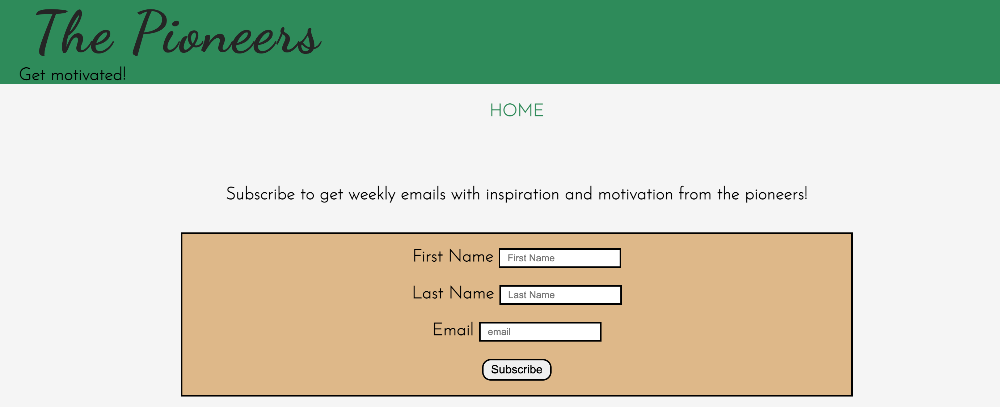
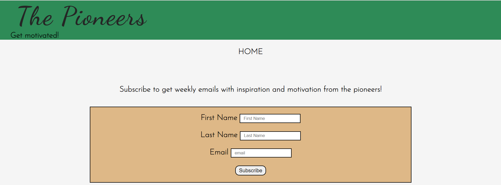
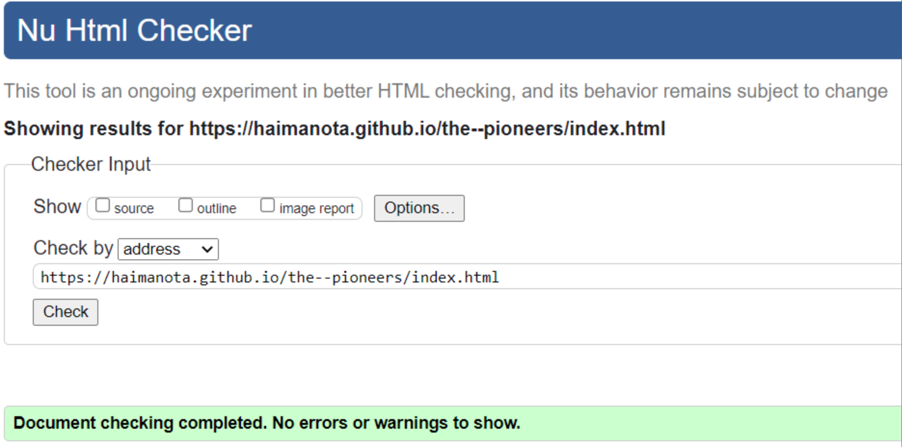
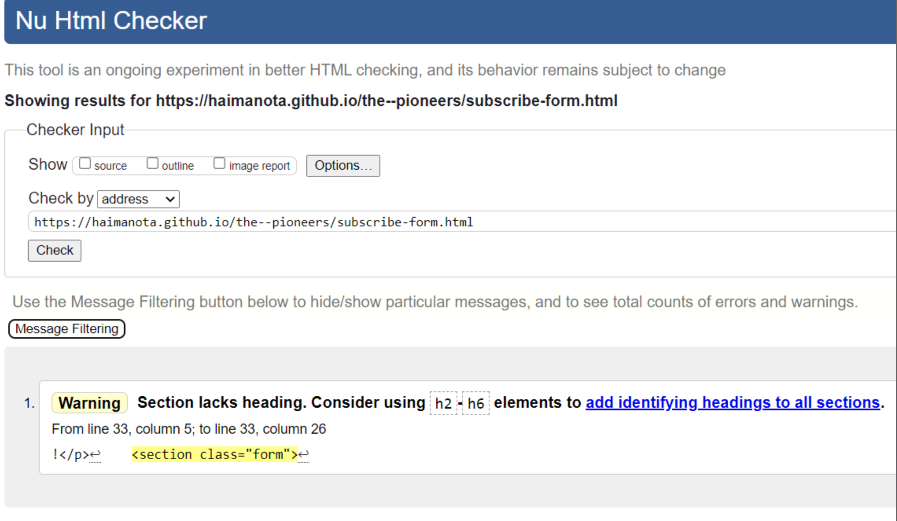
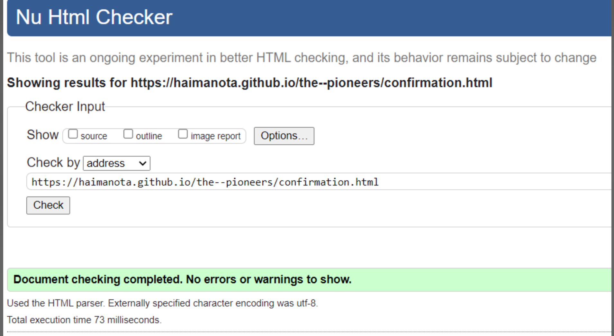
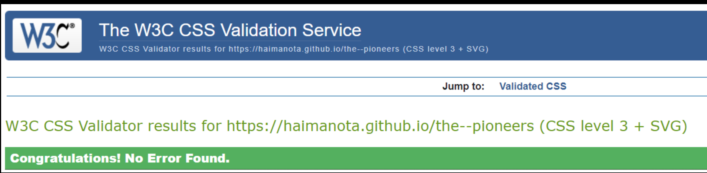
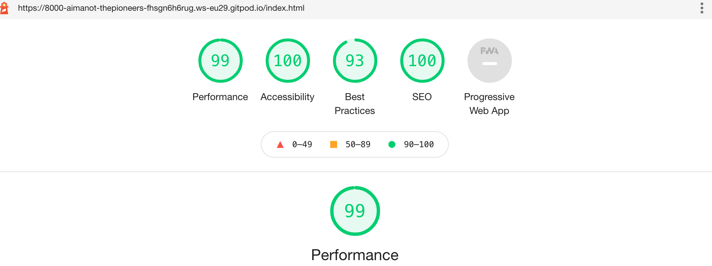

# The Pioneers

The pioneers is a website which aims to provide the biography of world changing inventors. The site will mainly target the young generation. It is designed to  motivate, inspire and encourage its target through the real life stories and inventions of successful people. 

## Technologies used

This website is developed using HTML, CSS and JavaScript programming languages. In addition the tools Gitpod, Github and Git are used.
 - HTML is used to create the content of the webpage.
 - CSS is used to style and specify the layout of the webpage.
 - JavaScript is used to create interaction between the user and the webpage. 
 - Gitpod is used as an editor to write and run our code.
 - Github is employed as code hosting platform, collaboration and securing our code against accidental or malicious loss.
 - Git is applied as a version control. 

## Features

 - The pioneers contain three pages,namely 'HOME', 'LIST OF PIONEERS' and 'SUBSCRIBE'.
 
 - The Homepage contains the hero header, navigation bar, images, quick facts, biography and at the very bottom of the web page links to social media.  

### Existing Features

- __The hero header__
    -  At the top of the website, there is an oversized banner containing the logo of the website - 'The pioneers' and the logo slogan -'Get motivated'. Its purpose is to convey the site's overall purpose for the users.

- __Navigation Bar__

    - The navigation bar is designed horizontally and placed in the center on the top of the page.
It contains the links to 'HOME', 'PIONEERS' and 'SUBSCRIBE'. 

1. HOME

    - The home links take the user to the site's homepage. 
It is repeated on the subscribe page as well to allow the user to easily return to the homepage without clicking the 'back' button. 

2. LIST OF PIONEERS

    - The 'list of pioneers' link is a clickable dropdown menu. The lists inside will be shown to the user when the button is clicked. 
    - This menu allows the user to choose one value at a time. 
    - With the dropdown menu, users are not expected to scroll down to reach the section they want. This helps to narrow user choices and save screen spaces. 

3. SUBSCRIBE

    - The subscribe page is where the user fills out the subscription form. 
    - The form takes the full name and email address from the user. 
    - The primary purpose of this page is to enable the user to receive inspirational and motivational stories from 'The Pioneers' via email.

3.1 Confirmation page

    - After the user correctly fill out and submitt the subscription form, he/she will be redirected to a new page. This new page will display a welcoming note for 10 seconds and then it will return the user to the homepage. If the user doesn't want to stay 10 seconds on this page, he/she can go to the homepage by clicking the Home link.

- __Images__

    - The Home page contains two portrait images. The images are included to catch users attention and to present the inventors.

- __Quick facts section__

    - This section highlights different facts about the pioneer presented. This will help the reader to quickly grasp the facts.

- __Biography section__

    - This section provides basic information about the pioneer's life. The reader discovers fascinating stories about their favorite icons here. 

- __The footer__

   - The footer section, placed at the bottom of the page, has links to social media. All of the links will open to a new tab so that the user stays on the website without distraction.

   - This section is where visitors should go when they have a question and want to contact a specific individual in the organization. 

## Features left to implement

   - Currently the site contains the biography of two pioneers. In the future it aims to include the biography and inventions of many more.

   -  To facilitate the search process a search engine will be developed.

## Testing

  - The page is tested on different browsers like chrome, safari and Microsoft edge. It functions very well on the browsers.

  - The following pages are screenshots taken from Microsoft edge browser.

   

   

   

  - The page is responsive and maintains its integrity when viewed on different size screens. 
 

  - The homepage link in the navigation menu, takes the user to the homepage if the user is on the subscribe page. 

  - The clickable dropdown menu functions well, and when the user clicks the name of the pioneer the page jumps to that specific section.

  - The subscribe page takes name, email and password. The user cannot submit without filling out its full name and email address. 

  - The confirmation page displays the welcome message and shifts to the homepage in 10 seconds.

  - The footer contains social media links and as it is intended all open in a new tab when clicked. 

### Validator Testing 

#### HTML Code Validation

I used the official W3C validation tool to test my code. I found no errors, but there is one acceptable warning present for a missing h2-h6.

- [index.html](https://validator.w3.org/nu/?doc=https://haimanota.github.io/the--pioneers/index.html)
    

- [subscribe-form.html](https://validator.w3.org/nu/?doc=https://haimanota.github.io/the--pioneers/subscribe-form.html)
    

- [confirmation.html](https://validator.w3.org/nu/?doc=https://haimanota.github.io/the--pioneers/confirmation.html)
    
 
#### CSS Code Validation

I used the official Jigaw validation tool to test my code. There are no errors or warnings present.

- [style.css](https://jigsaw.w3.org/css-validator/validator?uri=https%3A%2F%2Fhaimanota.github.io%2Fthe--pioneers)

- Accessibility 
 

### Unfixed Bugs
 - No bugs were discovered while creating and testing the project.

## Deployment

The site was deployed to GitHub pages. The steps to deploy are as follows: 
  - In the [GitHub repository](https://github.com/HaimanotA/the--pioneers), navigate to the Settings tab 
  - From the source section drop-down menu, select the **Main** Branch, then click "Save".
  - The page will be automatically refreshed with a detailed ribbon display to indicate the successful deployment.

The live link can be found [here](https://haimanota.github.io/the--pioneers)

### Local Deployment

In order to make a local copy of this project, you can clone it. In your IDE Terminal, type the following command to clone my repository:

- `git clone https://github.com/HaimanotA/the--pioneers.git`

Alternatively, if using Gitpod, you can click below to create your own workspace using this repository.

## Credits

**Content**

- The biography for both the pioneers is taken from wikipedia. 
- The text included in the 'Quick Facts' for Mark Zuckerbery is taken from the site [entrepreneur.com](https://www.entrepreneur.com/article/287422).
- The text included in the 'Quick Facts' for Elon Musk is taken from the site [timepath.co](https://timepath.co/elon-musk).

**Media**
- Both of the images on the home page were taken from wikipedia.

**Source Code**
- The code for the clickable dropdown menu on the navigation bar was taken from  [w3schools.com](https://www.w3schools.com/howto/howto_js_dropdown.asp).
